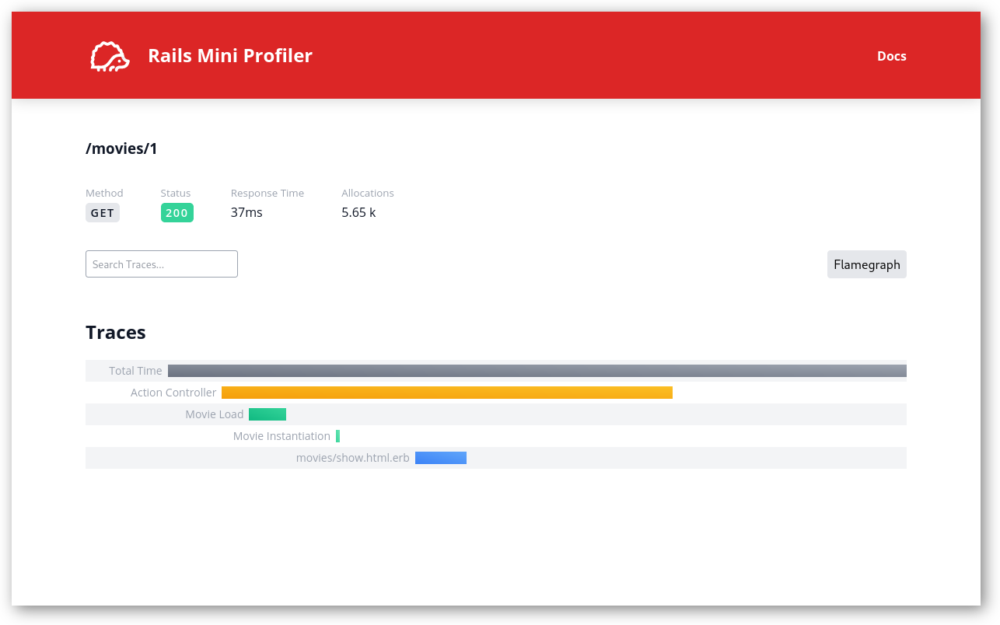
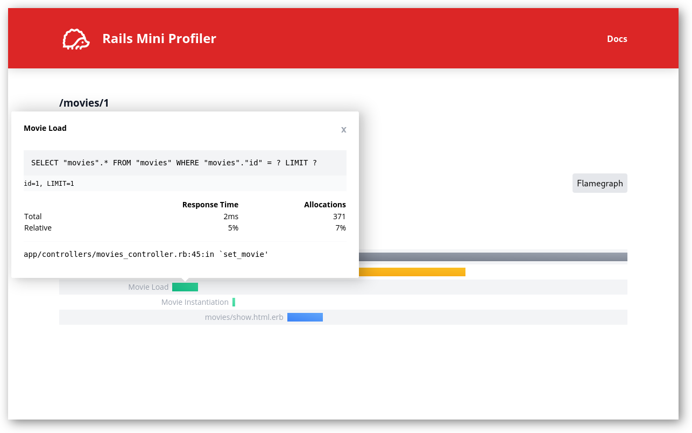

<div align="center">

# Rails Mini Profiler


### Performance profiling for Rails, made simple.

[](https://badge.fury.io/rb/graphql-groups)
[](https://github.com/hschne/rails-mini-profiler/actions/workflows/main.yml)
[](https://codeclimate.com/github/hschne/graphql-groups/test_coverage)

</div>

## What's this?

Rails Mini Profiler is an easy-to-use performance profiler for your Rails applications. It is heavily inspired by [Rack Mini Profiler](https://github.com/MiniProfiler/rack-mini-profiler) and other APM tools. Check out a short video preview below:

<div align="center">

[](https://www.youtube.com/watch?v=fSR8fCcsO8Q)

</div>

**Note**: This gem is in early development and I'm looking for contributors. Try it out and leave some feedback, it really goes a long way in helping me out with development. Any  [feature request](https://github.com/hschne/rails-mini-profiler/issues/new?assignees=&labels=type%3ABug&template=FEATURE_REQUEST.md&title=) or [bug report](https://github.com/hschne/rails-mini-profiler/issues/new?assignees=&labels=type%3AEnhancement&template=BUG_REPORT.md&title=) is welcome. If you like this project, leave a star to show your support! ⭐

## Getting Started

Add Rails Mini Profiler to your Gemfile:

```ruby
gem 'rails-mini-profiler'
```

Install the gem and run the installer:

```bash
bundle install
rails rail_mini_profiler:install
```

Inspect the generated migration in `db/migrate` and run it:

```
rails db:migrate
```

Start your Rails application and perform some requests. You can either click the little hedgehog 🦔 on the top
right or navigate to `/rails_mini_profiler` to view collected performance metrics.

## Usage

Rails Mini Profiler provides detailed information about your requests to help you figure out why certain requests perform poorly.

Installing it will generate a new initializer `config/initializers/rails_mini_profiler.rb` and add a new
route:

```ruby
# routes.rb
Rails.application.routes.draw do
  ...
  
  mount RailsMiniProfiler::Engine => '/rails_mini_profiler'
end
```

Once you perform requests against your applications you can inspect them using that route, or by clicking the badge on the
top right that is injected into your pages.

### Request Overview


Requests to your application will be profiled automatically. You can view all stored requests by navigating to `yourapp/rails_mini_profiler/profiled_requests`.

### Request Details

<p align="center">
  
&nbsp; &nbsp; &nbsp; &nbsp;
  
</p>

This view shows you how your requests spend their time. How much of it is spent in the DB, how much in rendering views?
By clicking on individual traces you can find out detailed information.

### Flamegraphs

Rails Mini Profiler per default records Flamegraphs for every profiled request for convenience. Note that Flamegraphs recording
incur a significant performance penalty, and can take up a lot of space.

To change the default behavior see [Configuration](#Configuration).

Flamegraphs are rendered using [Speedscope](https://github.com/jlfwong/speedscope). If Flamegraphs are not rendering
you may have to amend your content security policy. See [Troubleshooting](#Troubleshooting)

## Configuration

You can set the following configuration options in Rails Mini Profiler:

| Option                   | Default                      | Description                                                                                     |
|--------------------------|------------------------------|-------------------------------------------------------------------------------------------------|
| `enabled`                | `true` (dev)/ `false` (prod) | Whether or not RMP is enabled                                                                   |
| `badge_enabled`          | `true`                       | Should the hedgehog 🦔 badge be injected into pages?                                            |
| `badge_position`         | `'top-left'`                 | Where to display the badge. Options are `'top-left', 'top-right', 'bottom-left, 'bottom-right'` |
| `flamegraph_enabled`     | `true`                       | Should flamegraphs be recorded automatically?                                                   |
| `flamegraph_sample_rate` | `0.5`                        | The flamegraph sample rate. How many snapshots per millisecond are created.                     |
| `skip_paths`             | `[]`                         | An array of request paths that should not be profiled. Regex allowed.                           |
| `storage`                | `Storage`                    | Storage configuration. See [Storage](#Storage)                                                  |
| `user_provider`          | `Rack::Request.new(env).ip`  | How to identify users. See [Users](#Users)                                                      |

### Request Configuration

You may override the configuration by sending request parameters. The following parameters are available:

| Option           | Description                                                                                 |
|------------------|---------------------------------------------------------------------------------------------|
| `rmp_flamegraph` | Overrides `flamegraph_enabled` If set to `true` will redirect to the flamegraph immediatly. |

### Storage

Rails Mini Profiler stores profiling information in your database per default. You can configure various details of how
traces and requests are stored.

| Configuration             | Default                 | Description                                                                                               |
|---------------------------|-------------------------|-----------------------------------------------------------------------------------------------------------|
| `database`                | `nil`                   | Set a custom database to be used for storing profiler information. Uses `connect_to` for profiler records |
| `profiled_requests_table` | `rmp_profiled_requests` | The table to be used to store profiled requests.                                                          |
| `flamegraphs_table`       | `rmp_flamegraphs`       | The table to be used to store flamegraphs.                                                                |
| `traces_table`            | `rmp_traces`            | The table to be used to store traces.                                                                     |

Rails Mini Profiler does not offer an automatic way to clean up old profiling information. It is recommended you add a sweeper job to clean up old profiled requests periodically (e.g. using [clockwork](https://github.com/adamwiggins/clockwork). For example, with ActiveJob:

```
# Clockwork
every(1.month, 'purge rails mini profiler' do
    ProfiledRequestCleanupJob.perform_later
end

# ActiveJob
class ProfiledRequestCleanupJob < ApplicationJob
  queue_as :default

  def perform(*guests)
    RailsMiniProfiler::ProfiledRequest.where('created_at < ?', 1.month.ago).destroy_all
  end
end
```

### Users

Profiling information is segregated by user ID. That means users cannot see each other's profiled requests.

Per default, individual users are identified by their IP address. You may change this by setting a custom user provider:

```ruby
config.user_provider = proc { |env| Rack::Request.new(env).ip }
```

You may also explicitly set the user from the application itself:

```ruby
class ApplicationController < ActionController::Base
  ...
  
  before_action do 
    RailsMiniProfiler::User.authorize(current_user.id)
  end
end
```

Note that you **must** set the current user when running Rails Mini Profiler in production. No profiles will be saved otherwise.

### Profiling in Production

Rails Mini Profiler is not intended for performance reporting. There are other tools for that ( [Skylight](https://www.skylight.io/),
[New Relic](https://newrelic.com/), [DataDog](https://www.datadoghq.com/)...).

However, you can still use it in production to profile specific requests. Since profiling impacts performance, it is recommended
that you limit which requests are being profiled:

```ruby
RailsMiniProfiler.configure do |config|
  config.enabled = proc { |env| env.headers['RMP_ENABLED'].present? }
end
```

Only requests by explicitly set users will be stored. To configure how individual users are identified see [Users](#Users)

## Troubleshooting

### Flamegraphs are not rendering?

Flamegraphs are loaded into [Speedscope](https://github.com/jlfwong/speedscope) using an Iframe and URI Encoded blobs (see [source](https://github.com/hschne/rails-mini-profiler/blob/main/app/views/rails_mini_profiler/flamegraphs/show.html.erb))
If your browser gives you warnings about blocking content due to CSP you _must_ enable `blob` as default source:

```ruby
Rails.application.config.content_security_policy do |policy|
    policy.default_src :self, :blob
    ...
end
```

### Some requests have no Flamegraphs attached?

[StackProf](https://github.com/tmm1/stackprof), which is used for recording Flamegraphs, does not work on concurrent requests.
Because of this, concurrent requests may skip recording a Flamegraph.

It is recommended that you resend _only_ the request you wish to get a Flamegraph for.

## Credit

This project was heavily inspired by projects such as [rack-mini-profiler](https://github.com/MiniProfiler/rack-mini-profiler) and
[rack-profiler](https://github.com/dawanda/rack-profiler). [Skylight](https://www.skylight.io/) was also a huge influence.

[Lena Schnedlitz](https://github.com/LenaSchnedlitz) designed the Logo and provided great support. Without her supreme CSS skills this project would not have been possible :hands_raised:

## Contributing

See [Contributing](CONTRIBUTING.md)

## License

This gem is available as open source under the terms of the [MIT License](LICENSE).
